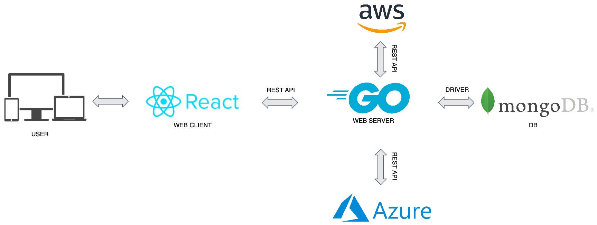

# Assistant

In questo periodo legato al Covid-19 molte aziende e professionisti sono stati costretti ad adattarsi allo Smart Working. A causa di questo sono sorte diverse problematiche. Tra queste ci sono quelle legate alla gestione e alla comunicazione interna nelle aziende e problematiche legate alle macchine da adoperare per svolgere il lavoro assegnato. 
Infatti, molti lavoratori, usufruendo spesso delle macchine disponibili presso l’azienda per svolgere le proprie mansioni, potrebbero riscontrare grossi problemi nel dover utilizzare macchine proprie in quanto, spesso, meno performanti. Inoltre, molte aziende a causa di scarsità di risorse e tempo non potrebbero permettersi di realizzare infrastrutture on-premise.
A tal proposito viene proposta una soluzione basata sull’utilizzo di alcuni servizi Cloud offerti dai diversi provider come AWS e Microsoft Azure.

**?Assistant** è una piattaforma web che offre le seguenti funzionalità:

* **Gestione di macchine virtuali.** L'utente ha la possibilità di creare macchine virtuali adatte alle esigenze dell’azienda e del singolo utente con pochi click. Il tutto restando all’interno della piattaforma, quindi senza interagire con ambienti esterni. Inoltre ha la possibilità di visualizzare lo stato delle macchine e il loro utilizzo.

* **Utilizzo di macchine virtuali.** In questo caso l'utente della piattaforma può accedere da remoto alle diverse macchine virtuali assegnate e può sfruttare tutta la potenza di calcolo di queste ultime. Il tutto è possibile anche utilizzando fisicamente una macchina poco performante per accedere alla web app.

* **Gestione dell' Identity Access Managment** 
  

<br>

## Architettura 
||
|:---:|
||

**Spiegazione atchitettura**:
<br>

## Cloud Providers supportati

* [Azure](https://azure.microsoft.com)
* [AWS](https://aws.amazon.com)
  
## Requisiti
* [Docker](https://www.docker.com)
* [Docker Compose](https://docs.docker.com/compose/)
  

## Installazione

### Docker

Installa [Docker](https://www.docker.com) usando la [guida](https://docs.docker.com/install/linux/docker-ce/ubuntu/#extra-steps-for-aufs).

```sh
$ sudo apt-get update
$ sudo apt-get install \
    apt-transport-https \
    ca-certificates \
    curl \
    gnupg \
    lsb-release
$ curl -fsSL https://download.docker.com/linux/ubuntu/gpg | sudo gpg --dearmor -o /usr/share/keyrings/docker-archive-keyring.gpg
$ echo \
  "deb [arch=amd64 signed-by=/usr/share/keyrings/docker-archive-keyring.gpg] https://download.docker.com/linux/ubuntu \
  $(lsb_release -cs) stable" | sudo tee /etc/apt/sources.list.d/docker.list > /dev/null
$ sudo apt-get update
$ sudo apt-get install docker-ce
```

------------------------------------------------------------------------------------------------------------------------------

### Docker Compose

Installa Docker Compose usando la [guida](https://docs.docker.com/compose/install/#install-compose).

```sh
$ sudo curl -L "https://github.com/docker/compose/releases/download/1.22.0/docker-compose-$(uname -s)-$(uname -m)" -o /usr/local/bin/docker-compose
$ sudo chmod +x /usr/local/bin/docker-compose
```

------------------------------------------------------------------------------------------------------------------------------

### ?Assistant

Installa ?Assistant con il seguente comando:

```sh
$ docker-compose up -d
```
<br>

## Contatti
* GitHub: 
  * [Lorenzo Fasolino](https://github.com/LorenzoFasolino) 
  * [Mario Egidio](https://github.com/Marioegidio) 
* e-mail: 
  * fasolinolorenzo@gmail.com 
  * egidiomario6@gmail.com


